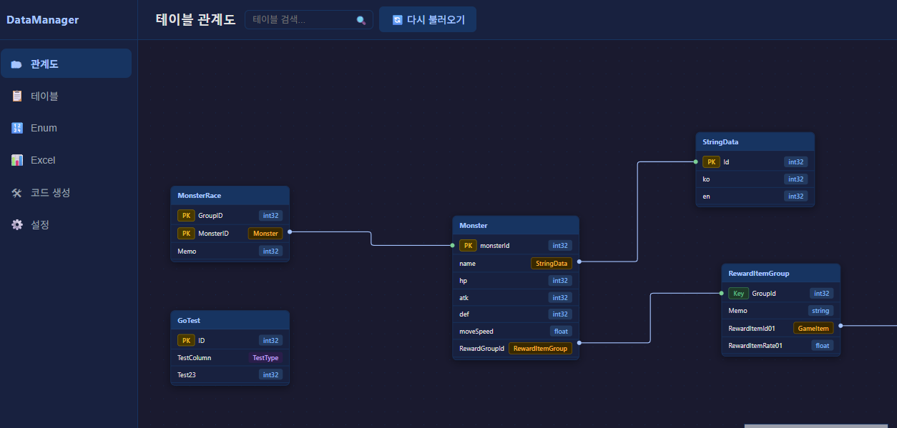

<div align="center">

# 📊 Data Manager

**An Electron application with React and TypeScript**

   

</div>

---

## ✨ 주요 기능



| 기능                             | 설명                                               |
| -------------------------------- | -------------------------------------------------- |
| 🗂️ **테이블 다이어그램**         | 테이블 간 참조 관계를 시각적으로 확인              |
| 📝 **테이블 · Enum 스키마 설정** | Proto 기반으로 스키마를 정의                       |
| 📊 **Excel 파일 생성**           | 스키마를 기반으로 드롭다운이 포함된 엑셀 파일 생성 |
| ⚙️ **코드 생성**                 | Protobuf, Unreal 데이터 컨테이너 자동 생성         |
| 🔄 **JSON 변환**                 | 엑셀 데이터를 JSON으로 변환                        |

---

## 🛠️ Project Setup

### Recommended IDE Setup

[VSCode](https://code.visualstudio.com/) + [ESLint](https://marketplace.visualstudio.com/items?itemName=dbaeumer.vscode-eslint) + [Prettier](https://marketplace.visualstudio.com/items?itemName=esbenp.prettier-vscode)

### Install

```bash
$ npm install
```

### Development

```bash
$ npm run dev
$ npm start
```

### Build

```bash
# For windows
$ npm run build:win

# For macOS (Currently not supported)
$ npm run build:mac
```

### Start

```bash
$ .\dist\win-unpacked\data-manager.exe
```

---

## ❓ FAQ

**Q. 무슨 목적으로 만들어졌나요?**  
A. AI를 활용해 단기간에 기획자 분들이 사용할 수 있는 데이터 툴을 제공하기 위해 개발된 프로토 타입입니다.  
이 프로젝트는 대부분의 작업이 Github Copilot으로 이뤄졌습니다.

**Q. 왜 Proto 파일을 기반으로 엑셀 테이블을 만들었나요?**  
A. 엑셀과 Json에 사용할 스키마를 명세할 수 있고 동시에 클라이언트/서버가 함께 사용할 수 있는 코드 생성이 가능하기 때문입니다.
